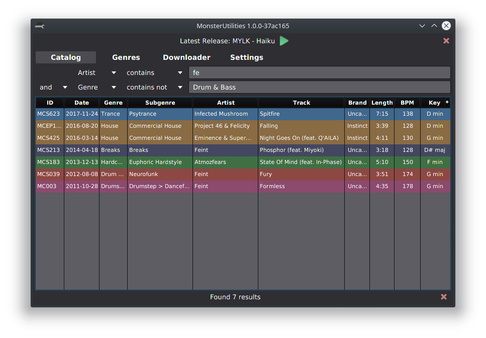
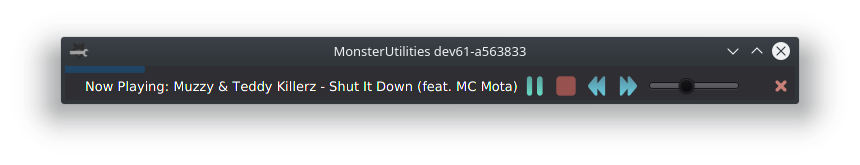
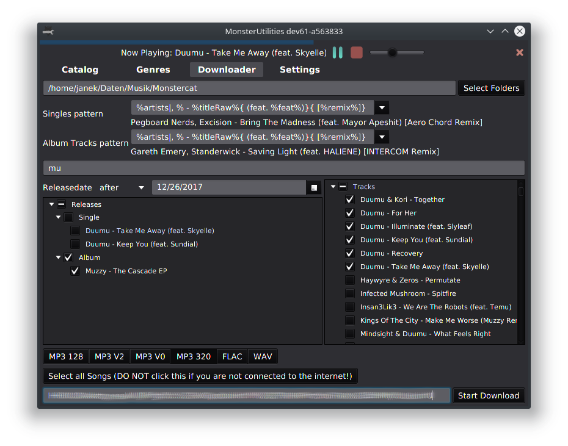
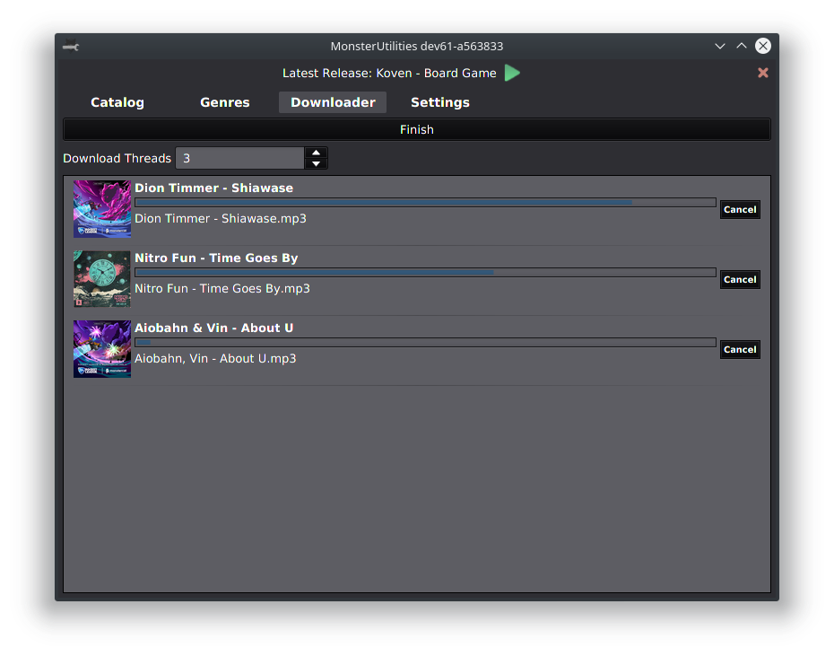
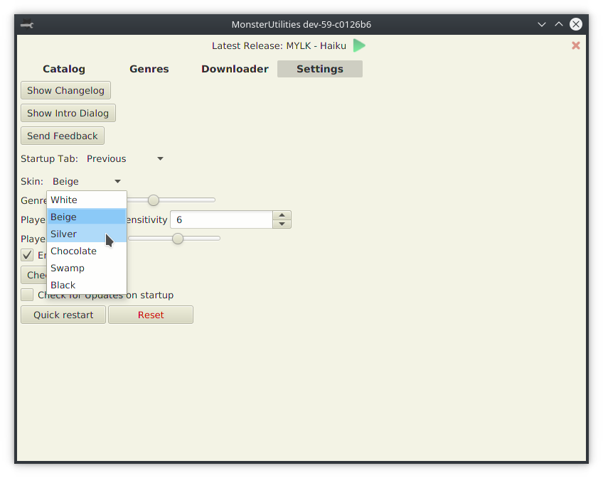

#  MonsterUtilities  

Browse, stream and download [Monstercat] Songs, powered by the [Monstercat API] and [MCatalog].

> Current state: The application has been used by many people without major problems. But it will probably stay in "beta" because the [main developers](#credits) are not as active anymore.  
We are however still available for questions in the [Discord] or via [GitHub issues][issues] and would welcome new contributors!

- [Getting started](#getting-started)
- [Troubleshooting](#troubleshooting)
- [Caching & Offline usage](#caching--offline-usage)
- [Screenshots](#screenshots)
- [Credits](#credits)

## Getting started

Packaged portable versions as well as OS-specific installers, optionally with a bundled JRE, are available from [GitHub releases](https://github.com/Xerus2000/monsterutilities/releases).  
For packages without a bundled JRE, the application requires [Java 8 by Oracle](https://www.java.com/download).

Make sure to read the initial in-app guide and watch out for tooltips.

### Authentication

For downloading and listening to early access, insert a valid `connect.sid` at the bottom of the Downloader.  
Obtain it though the process below or simply supply your credentials to the login form in the application.

1) [Sign in on monstercat.com][Monstercat-signin] and ensure that you have a valid [Monstercat Gold] subscription
2) Find a cookie for `connect.monstercat.com` in your browser  
   Chromium-based browsers: [chrome://settings/cookies/detail?site=connect.monstercat.com](chrome://settings/cookies/detail?site=connect.monstercat.com)  
   Firefox: Go to https://connect.monstercat.com/ (ignore any errors), open dev tools (Ctrl+Shift+I), go to `Storage > Cookies > https://connect.monstercat.com`
3) Find the content of `connect.sid` - a string starting with `s%3A` and around 90 characters in length
4) Copy that string into the `connect.sid` Textfield at the bottom of the Downloader

The `connect.sid` can be used to obtain full access to your account, so treat it carefully. The application never sends it anywhere but [Monstercat] servers.  
Please note though that it is persisted on your computer using the [Java Preferences API](https://stackoverflow.com/a/1320798) for your convenience.

### Caching & Offline usage

Sometimes the cache runs into issues which may cause problems in the Downloader. In that case use the "Clear cache & Restart" button in the settings to reset the cache.

Upon starting the application for the first time, it will fetch and cache all Releases as well as Sheets (Catalog/Genres). This might take some time depending on your internet connection. On subsequent use it will prefer to fetch incrementally, reducing the load on your connection as well as [Monstercat]'s Servers.  
Once fetched, Songs can be **browsed offline** but **not played or downloaded**.

Cache and logs are stored in a temporary directory, depending on your operating system:
- Windows: `C:\Users\<username>\AppData\Local\Temp\monsterutilities` - can be changed by editing the `java.io.tmpdir` system property
- Unix: `/var/tmp/monsterutilities`, or under `/tmp` if `/var/tmp` does not exist

## Screenshots

### Catalog

The Catalog provides an overview of all Tracks ever released on the label with extensive filtering possibilities.

_Tip: You can customize which columns to show by clicking the `+` in the top right of the table._

### Streaming

There is a player on the top that can stream any Monstercat track, just like the website. 
Double-click on any piece in the Catalog or Downloader to load it into the Player!

### Downloader

If you have Monstercat Gold you can bulk download everything according to your preferences!

### Customization

The application has various color schemes and configuration options.

## Credits

[@xerus2000](https://github.com/xerus2000) [founded the project](assets/Story.md) and established most of its features. He still technically owns it, but has [mostly moved on to other projects](https://github.com/search?q=author%3Axerus2000&type=Issues).  
[@defvs](https://github.com/defvs) is currently the main maintainer, but rarely gets around to anything other than critical fixes.

We thank  for providing a free license to build the installers.

[issues]: https://github.com/xerus2000/monsterutilities/issues
[Discord]: https://discord.gg/ZEusvHS
[Monstercat]: https://monstercat.com
[Monstercat API]: https://github.com/defvs/connect-v2-docs/wiki
[Monstercat Gold]: https://www.monstercat.com/gold
[Monstercat-login]: https://www.monstercat.com/signin
[MCatalog]: https://docs.google.com/spreadsheets/d/116LycNEkWChmHmDK2HM2WV85fO3p3YTYDATpAthL8_g
