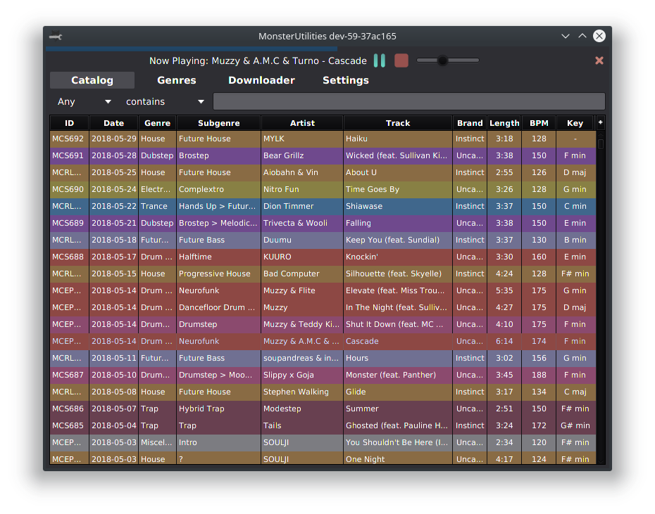
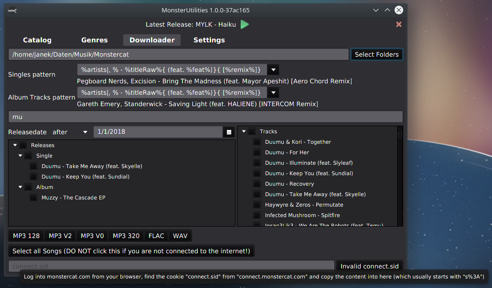

# MonsterUtilities

Utilises the Monstercat API and MCatalog to browse, listen to and download Songs.
Additionally provides a Genre overview.

Works cross-platform. Developed with Java 8 on Linux.

## Screenshots

### Catalog

#### Extensive Filtering

### Downloader

### Configurable

## Development 

Gradle is used for building the project.

My [util project](https://github.com/Xerus2000/util) needs to be checked out in the parent directory.