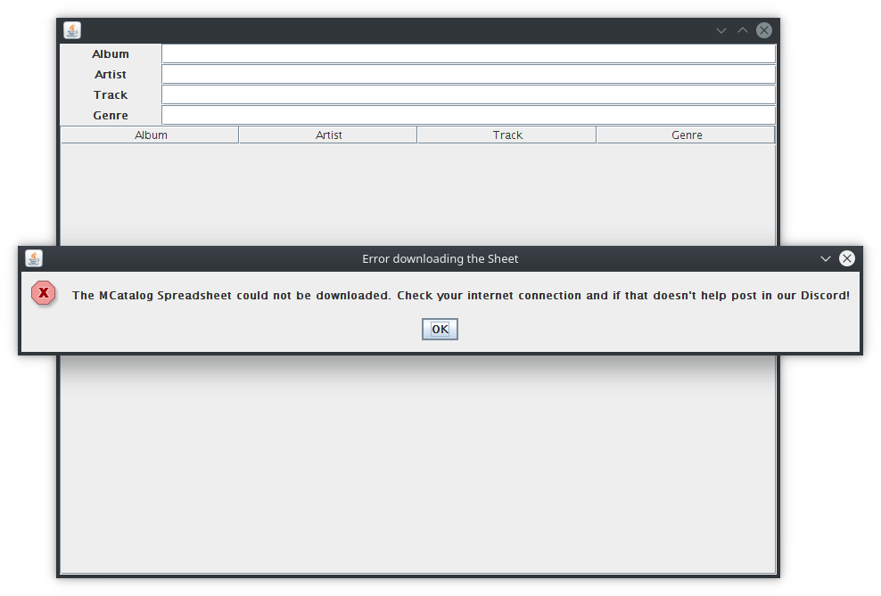
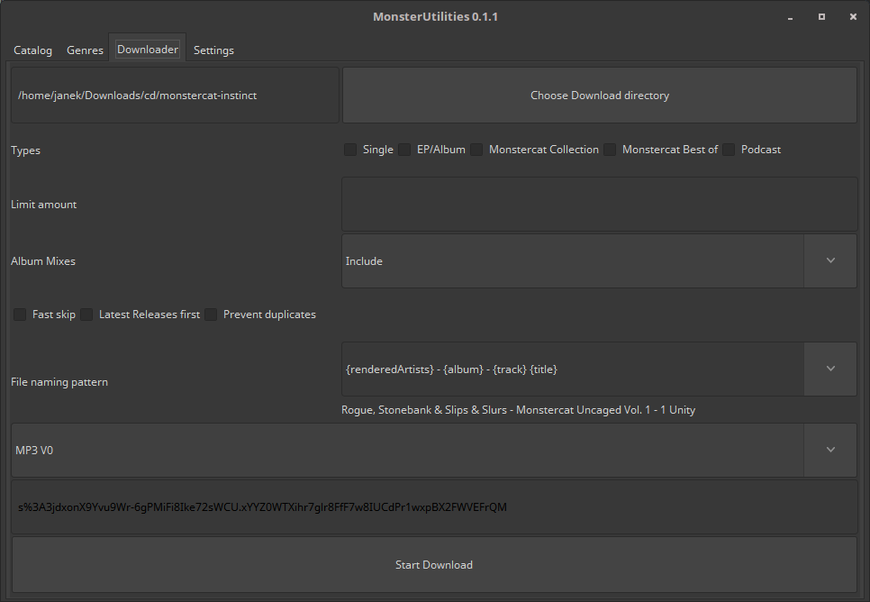
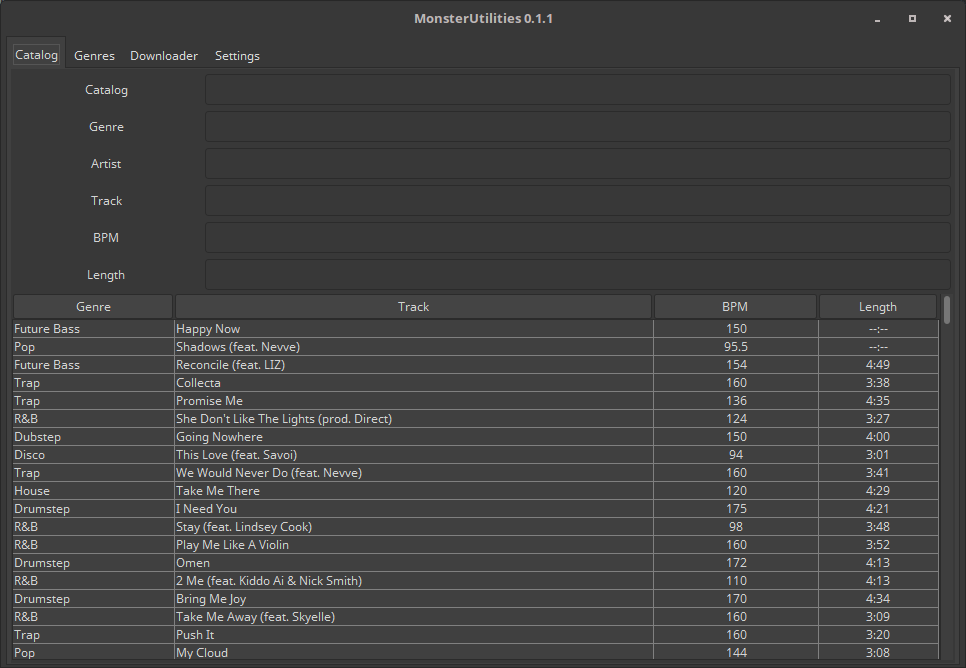
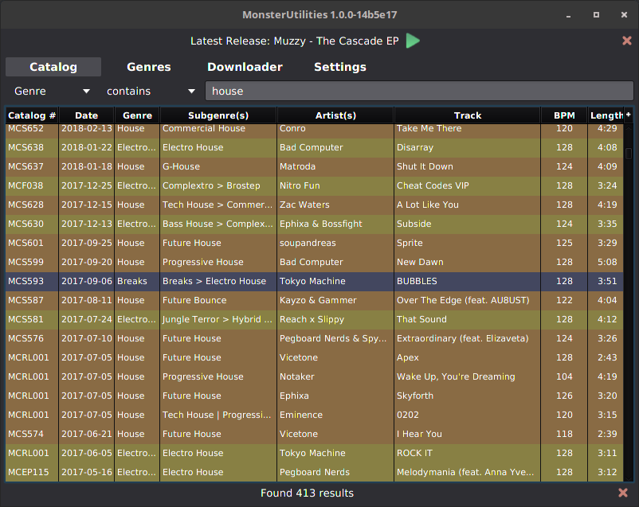

Me, 05.07.2017: "What was that Feint track that was not DnB? How could I find out without digging through everything?" - 
"Hey I recently found this spreadsheet called the [MCatalog](https://rebrand.ly/mcatalog). 
But how do I conveniently query it for an Artist and an inverted Genre?"

An idea was born. I discovered the Google Spreadsheets API and created a first version:

*Since I created the screenshot only now, the program doesn't work anymore, and it wasn't tracked in git back then.*

Then I bought Monstercat Gold and wanted to download all tracks. So I searched for tools that did that.
But after some searching I came to the conclusion that there was no really helpful tool around.
I was neither satisfied with the default naming pattern when downloading from Monstercat, nor did I want to deal with a 
bazillion zips and cover.false-files. So I settled out to explore the possibilities of the Monstercat API.
After some work and experimentation, this emerged:

But there were still some major points I wanted to address:

- Searching the Catalog was too inflexible, and there was no possibility to invert a query
- The Interface was straightup ugly
- The website can stream songs, so why wouldn't I?

So I decided to take on a rework, with a full UI overhaul. This is the current version. 
It's still not finished, but it does mostly work:

